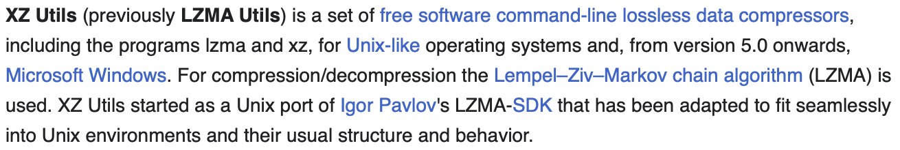
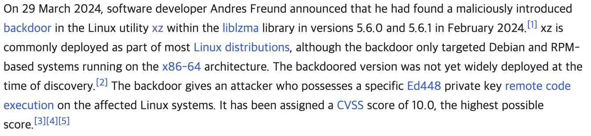

# xz-utils backdoor(CVE-2024-0394)

Last Modified: 2024.04.22(Mon)

## Overview
1. [Information](#1-information)
2. [Target](#2-target)
3. [Impact](#3-impact)
4. [Procedures](#4-procedures)
5. [Conclusion](#5-conclusion)
6. [MITRE ATT&CK Metrics](#6-mitre-attck-metrics)
7. [Reference](#7-reference)

## 1. Information

### 1-1. Summary

- CVSS Score: **10/10**
- Malicious activity detected at **2024.03.29(Fri)**
- Reported by **Andres Freund**
- Actor is a maintainer named **JiaT75(JiaTan) - Jia Cheong Tan**
- Using **xz 5.6.0 and 5.6.1** within **liblzma library**

### 1-2. About xz-utils

### 1-3. About xz-utils backdoor

### 1-4. Further more information

- The attack appears to be **the first serious known supply chain attack** on widely used **open source software**
- American security researcher **Dave Aitel** has suggested that it fits the pattern attributable to **APT29**, an advanced persistent threat actor believed to be working on behalf of the **Russian SVR**.

## 2. Target

All infrastructure that using **linux based x86_64 architecture**.

## 3. Impact

Impact

## 4. Procedures

### 4-1. Set up
- `configure.ac`
- `CMakeLists.txt`
- `projects/xz/builds.sh`
- `src/liblzma/check/crc_x86_clmul.h`

 

### 4-2. Exploit
1. `m4/build-to-host.m4`
2. `test/files/bad-3-corrupt_lzma.xz`
3. `test/files/good-large_compressed.lzma`
4. `.libs/liblzma_la-crc64_fast.o`

 

### 4-3. Inject
1. `src/liblzma/Makefile`
2. `libtool`
3. `src/liblzma/check/crc64_fast.c`

[Link - xz-utils backdoor analysis](/Unknown/xz-utils_backdoor/analysis.md)

## 5. Conclusion

## 6. MITRE ATT&CK Metrics

## 7. Reference
1. [NIST/NVD - CVE-2024-3094](https://nvd.nist.gov/vuln/detail/CVE-2024-3094)
2. [tukaani(Owner) Blog](https://tukaani.org/xz-backdoor/)
3. [Wikipedia - XZ Utils](https://en.wikipedia.org/wiki/XZ_Utils)
4. [Wikipedia - XZ Utils backdoor](https://en.wikipedia.org/wiki/XZ_Utils_backdoor)
5. [Details by Andres Freund](https://www.openwall.com/lists/oss-security/2024/03/29/4)
6. [FAQ by Sam James](https://gist.github.com/thesamesam/223949d5a074ebc3dce9ee78baad9e27)
7. [Gentoo bug 928134](https://bugs.gentoo.org/928134)
8. [Debian bug 1068024](https://bugs.debian.org/cgi-bin/bugreport.cgi?bug=1068024)
9. [Timeline by Russ Cox](https://research.swtch.com/xz-timeline)
10. [Script analysis by Russ Cox](https://research.swtch.com/xz-script)
11. [amlweems - xzbot](https://github.com/amlweems/xzbot)

---
[Go to top](#xz-utils-backdoorcve-2024-0394)